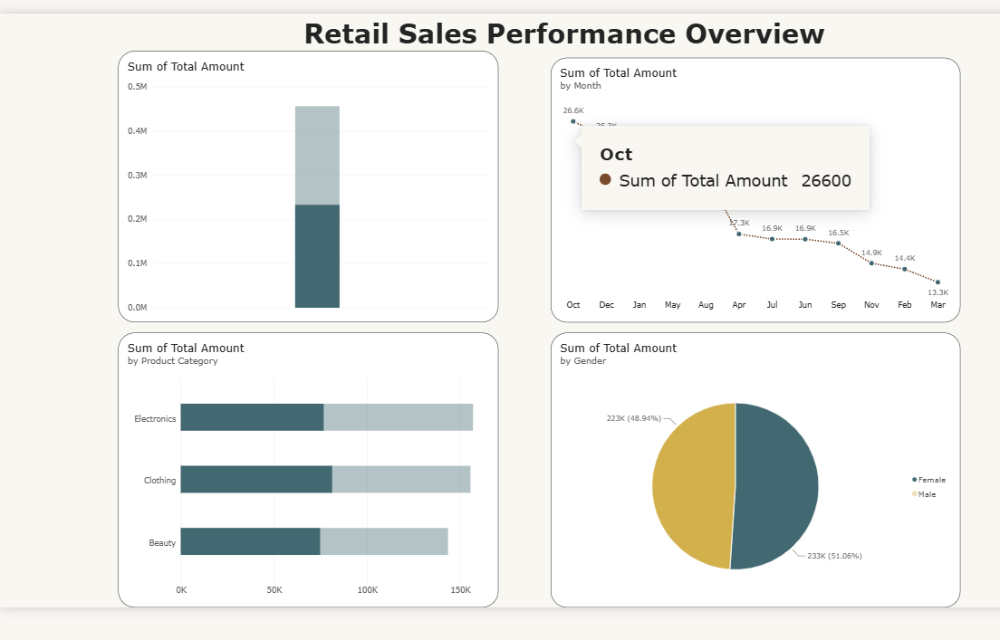

# Retail Sales Analysis

SQL analysis of a retail/e-commerce sales dataset (1,000 transactions) — data cleaning, querying, and business insights.

## Tools used
SQL Server · Excel

## Files
- [queries.sql](./queries.sql) — 8 business questions answered via SQL

## Key Findings

Electronics was the top-performing category by total revenue ($156,905), narrowly ahead of Clothing ($155,580), suggesting the store's two strongest categories are closely matched rather than dominated by one. Female customers generated slightly higher total revenue than male customers ($232,840 vs $223,160), a modest but consistent gap. Interestingly, Gen Z customers had the highest average order value ($500) despite typically being assumed to spend less than older groups — while Clothing was specifically their most popular category (85 orders among under-30 customers). May was the strongest sales month ($53,150), roughly double September's low ($23,620), pointing to a seasonal pattern worth investigating further.

**Recommendation:** given Gen Z's high average spend and clear category preference, targeted Clothing promotions aimed at younger customers — especially timed around the May sales peak — could be a high-leverage next step for the business.

## Results Summary

| Metric | Result |
|---|---|
| Total Revenue | $456,000 |
| Average Order Value | $456 |
| Top Category | Electronics ($156,905) |
| Best Month | May ($53,150) |
| Top Spending Age Group | Gen Z (avg $500) |
